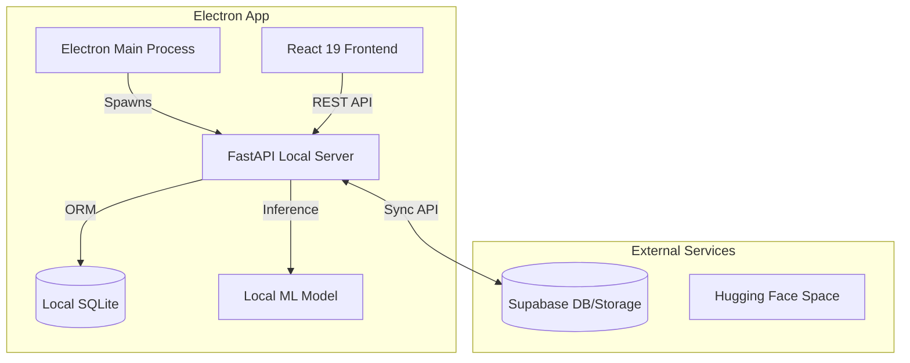

# Retina Max 2.0 - Diabetic Retinopathy Screening Suite

Retina Max 2.0 is a professional, enterprise-grade Medical AI platform designed for ophthalmologists to screen, track, and prioritize Diabetic Retinopathy (DR) cases. Built as a cross-platform desktop application with offline-first capabilities, it enables clinical screening even in environments with intermittent or no internet connectivity.

---

## 📺 Project Overview

The application empowers clinicians to:
- **Screen with AI**: Classify fundus images into 5 standard DR stages (No DR, Mild, Moderate, Severe, Proliferative).
- **Explainable AI (XAI)**: View Grad-CAM heatmaps highlighting regions affecting the AI's diagnosis.
- **Patient Management**: Maintain comprehensive longitudinal records, history, and metadata.
- **Offline-First Workflow**: Run full AI inference and database operations locally, syncing with a cloud server when online.
- **Dual-Mode Adaptive Screening**: Toggle between standard efficiency and high-sensitivity preventative modes.
- **Clinical Safety Overrides**: Real-time detection of severe cases that bypass thresholding for immediate referral.
- **Micro-Animations & Premium UI**: A modern "Nordic Clinical" aesthetic built with Material Design 3 and Framer Motion.

---

## 🏗️ System Architecture

The project follows a decoupled, local-first architecture combining Electron, React, and FastAPI.

### 1. Backend (Python + FastAPI)
The engine of the application, responsible for AI inference and data persistence.
- **Core Modules**: `app.main` (FastAPI app), `app.api` (REST endpoints), `app.services` (AI and Logic).
- **Local AI**: uses **PyTorch**, **torchvision**, and **timm** (EfficientNet-B3) for offline fundus image classification and Grad-CAM generation.
- **Sync Logic**: Implements a robust `client_uuid`-based sync mechanism (`app/api/sync.py`) for consistency between local and cloud databases.

### 2. Frontend (Electron + React)
A high-performance UI layer that communicates with the local backend.
- **Framework**: React 19 + Vite + Tailwind 4.
- **Desktop Bridge**: Electron 32 manages windowing, spawns the local Python backend, and provides access to system resources.
- **Communication**: Frontend sends requests to `localhost:[dynamic_port]`. Port discovery is handled by Electron at startup.

### 3. Data & Sync
- **Local DB**: SQLite managed via SQLAlchemy ORM.
- **Cloud DB**: PostgreSQL/Supabase (configured via environment variables).
- **Sync Mechanism**: Records are tracked using `client_uuid` and `updated_at` timestamps. The sync service exports local changes and imports remote updates using a "since" timestamp filter.



---

## 🚀 Installation & Setup

### Prerequisites
- **Node.js**: 18+ (latest LTS recommended)
- **Python**: 3.10+
- **Git**

### 1. Backend Setup
```bash
cd backend
python -m venv venv
source venv/bin/activate  # On Windows: .\venv\Scripts\activate
pip install -r requirements.txt
# For local AI support:
pip install -r requirements-desktop.txt
```
*Create a `.env` file in `backend/` using `.env.example` as a template.*

### 2. Frontend Setup
```bash
cd frontend1
npm install
```

### 3. Desktop Setup
```bash
cd desktop
npm install
```

---

## 🛠️ Development & Building

### Running in Development
To start the full desktop suite (Frontend + Electron + Backend):
```bash
cd desktop
npm run dev
```

### Packaging the App
1. **Build Frontend**: `npm --prefix ../frontend1 run build`
2. **Build Backend (PyInstaller)**: `powershell -File ../backend/scripts/build_desktop_backend.ps1`
3. **Package Electron**: `npm run build` (This runs `electron-builder`)
*The final executable will be in `desktop/release/`.*

---

## 📁 Project Structure

```text
├── assets/             # Media and static branding assets
├── backend/            # FastAPI source code
│   ├── app/
│   │   ├── api/       # API endpoints (sync, patients, reports, inference)
│   │   ├── db/        # SQLAlchemy engine & migrations
│   │   ├── models/    # Database tables (Patient, Report, User)
│   │   └── services/  # AI logic (local_ai_service, ai_service)
│   ├── scripts/        # Build and utility scripts
│   └── desktop_server.py # Entry point for local backend server
├── desktop/            # Electron wrapper and config
│   └── src/
│       ├── main.js    # Electron main: Spawns backend & browser
│       └── preload.js  # IPC bridge between Renderer and Main
├── frontend1/          # React 19 codebase
└── ml_pipeline/        # Model training and evaluation scripts
```

---

## 🌩️ Offline & Sync Details

### Local Connectivity
- The app runs a dedicated FastAPI server on a random free port discovered at launch.
- Database path: `%APPDATA%/retina-max-desktop/retina-max.sqlite3` (on Windows).

### Sync Logic
- **Export**: The app polls for records where `updated_at > last_sync_time`.
- **Import**: Incoming records from the cloud are matched by `client_uuid`. Existing records are updated only if the remote `updated_at` is newer.
- **Images**: Reports include local paths/filenames. In cloud mode, images are uploaded to Supabase Storage.

---

## 🧪 Testing & Debugging

- **Debugging Backend**: Set `LOG_LEVEL=debug` in your `.env`. You can use `curl http://localhost:[port]/health` to check server status.
- **Inspecting Database**: Use a SQLite browser to open the `.sqlite3` file in the app data directory.
- **Testing Sync**: Trigger manual sync via the Settings/Sync dashboard and monitor terminal logs for "Sync import" messages.

---

## 📝 Future Improvements
- [ ] **Image Caching**: Local caching of cloud-hosted images for smoother history viewing.
- [ ] **Visit Notes**: Dedicated model for patient visits with rich text support.
- [ ] **Dirty Flags**: Explicit bit tracking for locally modified records to optimize sync performance.
- [ ] **On-Device Quantization**: Move to INT8 models to reduce memory footprint on older desktops.

---

Developed with ❤️ by the Retina Max Team.
