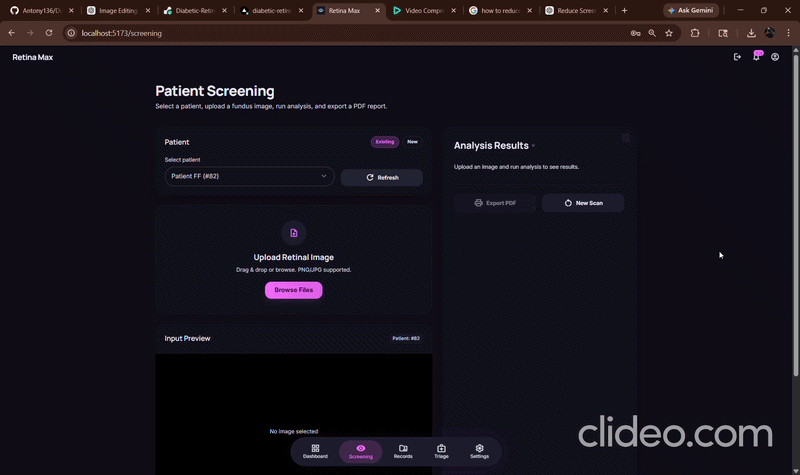
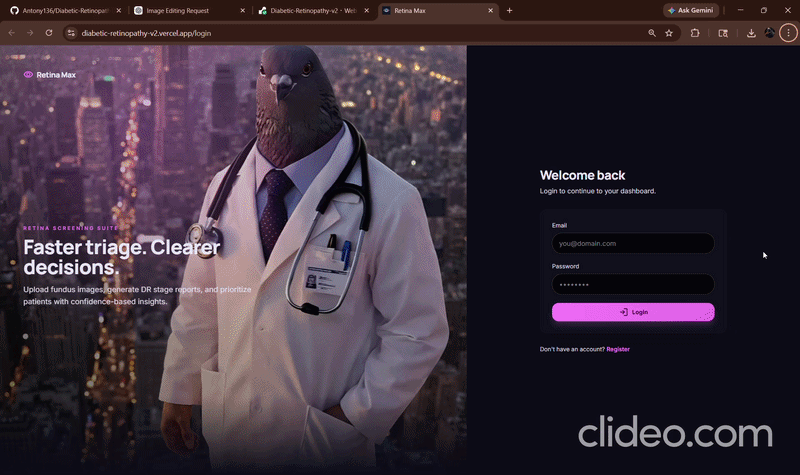
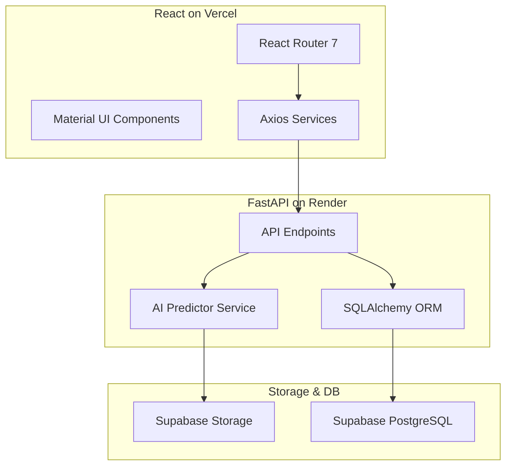

# Retina Max 2.0 - Diabetic Retinopathy Screening Suite

Retina Max 2.0 is a production-grade, visually stunning Medical AI platform designed to help ophthalmologists screen and prioritize Diabetic Retinopathy (DR) cases using fundus images. It features real-time AI classification, Grad-CAM heatmap visualization, and comprehensive patient history management.

## 📺 Demo Videos

### 1. ML Model Analysis


### 2. Admin Dashboard & Login


## 🌟 Key Features

- **AI-Powered Screening**: Instantly classify fundus images into 5 stages of DR (No DR, Mild, Moderate, Severe, Proliferative).
- **Explainable AI (XAI)**: Generates Grad-CAM heatmaps to highlight specific regions influencing the AI's decision, building doctor trust.
- **Patient Management**: Full CRUD operations for patients, including screening history and longitudinal tracking.
- **Visual Analytics**: Interactive dashboards with Recharts to monitor patient progress and clinic trends.
- **Export Capabilities**: Generate professional PDF reports for patients and export screening data to CSV.
- **Micro-Animations**: Ultra-smooth UX with Framer Motion and modern Material Design 3 principles.
- **Cloud Scale**: Fully integrated with Supabase Storage for reliable image hosting.

## 🛠️ Technical Stack

### Frontend
- **Framework**: React 19 + Vite
- **Styling**: Tailwind CSS 4 + Material Design 3
- **Animations**: Framer Motion
- **Charts**: Recharts
- **State/Routing**: React Router 7 + Axios
- **Type Safety**: TypeScript

### Backend
- **Core**: FastAPI (Python 3.10+)
- **AI/ML**: PyTorch (CPU-optimized), Timm (EfficientNet-B3), Numpy
- **Database**: PostgreSQL (SQLAlchemy ORM)
- **Deployment**: Gunicorn + Uvicorn
- **Storage**: Supabase Storage Bucket integration

### ML Pipeline
- **Architecture**: EfficientNet-B3 (Transfer Learning)
- **Data Augmentation**: Mixup, Random Color Jitter, Horizontal/Vertical Flips
- **Loss Function**: Label Smoothing Cross Entropy
- **Explainability**: Integrated Grad-CAM hooks

## 🏗️ Project Architecture



## 🚀 Installation & Local Development

### 1. Prerequisites
- Python 3.10+
- Node.js 18+
- [Git](https://git-scm.com/)

### 2. Backend Setup
```bash
cd backend
python -m venv venv
source venv/bin/activate  # On Windows: .\venv\Scripts\activate
pip install -r requirements.txt
python -m uvicorn app.main:app --reload
```
*Note: Ensure your `.env` file contains your `DATABASE_URL`, `SUPABASE_URL`, and `SUPABASE_KEY`.*

### 3. Frontend Setup
```bash
cd frontend1
npm install
npm run dev
```
*The app will be available at http://localhost:5173*

## 🌩️ Deployment

### Render (Backend)
The backend is optimized for Render's Free Tier (512MB RAM):
- **Memory Optimization**: Uses `torch.set_num_threads(1)` and manual garbage collection to stay within RAM limits.
- **Timeout**: Increased to 300s to accommodate AI model loading on startup.
- **Gunicorn**: Configured with `--worker-tmp-dir /dev/shm` for heartbeat stability.

### Vercel (Frontend)
The frontend uses `vercel.json` for SPA routing and asset protection:
```json
{
  "rewrites": [
    {
      "source": "/((?!api|assets|.*\\..*).*)",
      "destination": "/index.html"
    }
  ]
}
```

## 🧠 Memory Optimization Details
Running a Torch-based AI model on a 512MB RAM limit is challenging. This project implements several "RAM Diet" strategies:
- **Matplotlib Replacement**: Uses a pure Numpy/Pillow implementation for JET colormaps to save ~100MB RAM.
- **Gradient Purging**: `model.zero_grad(set_to_none=True)` is called immediately after heatmap generation.
- **Weight Deletion**: Checkpoint dictionaries are deleted immediately after loading into the model architecture.

---

## Desktop (Offline-Capable)

An Electron wrapper with a bundled local FastAPI backend (SQLite + local ML inference) lives in `desktop/`.
See `desktop/README.md` for build + packaging instructions.

